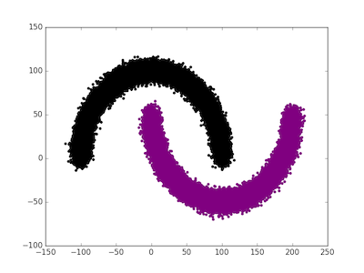
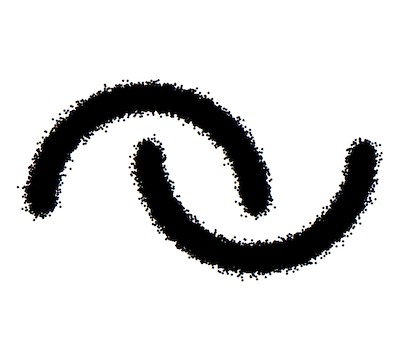
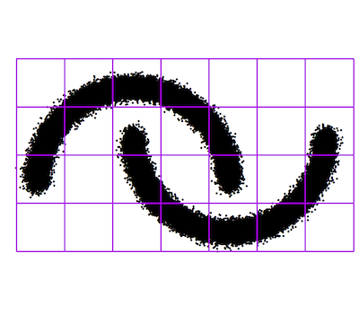
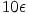
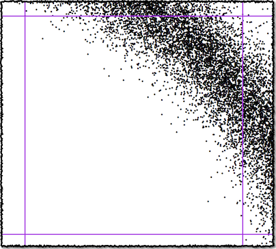
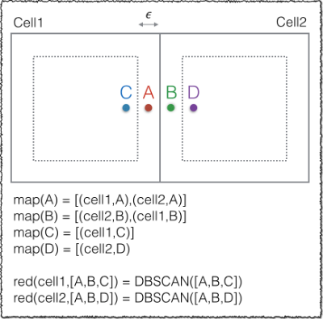
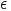
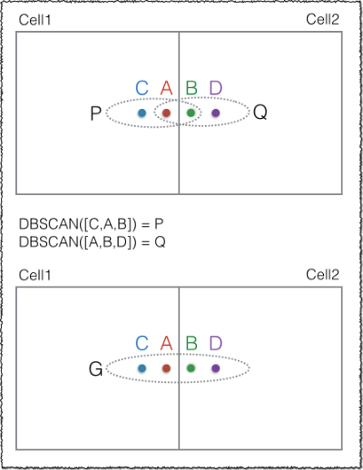
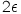

# DBSCAN On Spark

[DBSCAN](https://en.wikipedia.org/wiki/DBSCAN) implementation on [Apache Spark](http://spark.apache.org/).

## Building The Project

The build process is based on [Apache Maven](https://maven.apache.org/) - However I've added an [SBT](http://www.scala-sbt.org/) build for reference. 

```bash
mvn clean package
```

## Sample Data Generation

Create a [python virtual environment](http://docs.python-guide.org/en/latest/dev/virtualenvs/) - For OS X users, check out [Install Python 2.7, virtualenv and virtualenvwrapper on OS X Mavericks/Yosemite](http://www.marinamele.com/2014/05/install-python-virtualenv-virtualenvwrapper-mavericks.html)

```bash
source /usr/local/bin/virtualenvwrapper.sh

mkvirtualenv my-env

pip install --upgrade pip
pip install numpy
pip install scipy
pip install sklearn
pip install matplotlib
```

```python
import numpy as np
from sklearn import datasets
np.random.seed(0)
n_samples = 100000
noisy_moons = datasets.make_moons(n_samples=n_samples, noise=.05)
X,_ = noisy_moons
with open("/tmp/moons.txt", "wb") as fw:
    for i in range(n_samples):
        fw.write( "{} {} {}\n".format(i,X[i][0]*100,X[i][1]*100))        
```

## Sample Local Runs

```bash
spark-submit\
 --master "local[*]"\
 --driver-java-options="-server -Xms1g -Xmx16g"\
 target/dbscan-spark-0.1.jar\
 moons.properties
```

Content of `moons.properties`:

```properties
input.path=/tmp/moons.txt
output.path=/tmp/output
dbscan.eps=5
dbscan.min.points=5
```

Aggregate the output content into a single file for later visualization:

```bash
cat /tmp/output/part* > /tmp/parts.csv
```

## Visualize the Data

We will use [Matplotlib](http://matplotlib.org/). Check out [Working with Matplotlib in Virtual environments](http://matplotlib.org/faq/virtualenv_faq.html).

Had to add the following to my `.bashrc`:

```bash
function frameworkpython {
    if [[ ! -z "$VIRTUAL_ENV" ]]; then
        PYTHONHOME=$VIRTUAL_ENV /usr/local/bin/python "$@"
    else
        /usr/local/bin/python "$@"
    fi
}
```

Start a Python session:

```bash
frameworkpython
```

```python
import numpy as np
import matplotlib.colors as clr
import matplotlib.pyplot as plt

moons = np.genfromtxt('/tmp/moons.txt', delimiter=' ', names=['id', 'x', 'y'])
plt.figure(1)
plt.scatter(moons['x'],moons['y'],color='r')

parts = np.genfromtxt('/tmp/parts.csv', delimiter=',', names=['id', 'x', 'y', 'c'])
colors = ['black','red','green','blue','purple']
plt.figure(2)
plt.scatter(parts['x'],parts['y'],c=parts['c'], cmap=clr.ListedColormap(colors), lw=0)
plt.show(block=False)
```



## How Does It Work ?

First, check out [DBSCAN](https://en.wikipedia.org/wiki/DBSCAN) and how _it_ works. Basically, it continuously group into the same cluster the points that are near each other (or within a certain distance from each other).
The following is the process of how do to this on a distributed, share-nothing platform.



Given the above points, a virtual fishnet is cast on the point space.



The points in the same cells are processed together in a distributed matter.
This togetherness is achieved by mapping the point coordinates (x,y) to the cell lower left corner (r,c).
All the points that have the same (r,c) are grouped together and locally processed on different nodes.
This is a very simple partitioning scheme to distribute spatial data, where the user can specify the fishnet cell size.
By default, the fishnet cell size is  in this implementation.
Below are references to implementations where the partitioning is proportional to the density of the data.
The data is scanned through and subdivided to generate a fishnet with different cell sizes.

DBSCAN clusters points based on their proximity to each other.
When the point space is partitioned based on cells and executed on different nodes, the edge points do not "see" all their neighbors as they are not in the processing partition.



In the above figure, the points in the center cell are processed together on one node and each surrounding cell with its points is processed by a different node.   
So the question is; How do I make a point A in cell 1 "see" a point B in cell 2 on a share-nothing platform ?
Simple, you make point A part of cell 2 and you make point B part of cell 1 ! Let me illustrate:



So, all points in a cell that are  away from the edge are emitted to the neighboring cells, in such that now, we can perform per node a local DBSCAN.
This double processing of the same edge point by two nodes is actually a blessing, as we can now relate and merge two neighboring local clusters into one global one. The handling of cluster merging by edge points is inspired from the [Hadoop MapReduce](https://hadoop.apache.org/docs/current/hadoop-mapreduce-client/hadoop-mapreduce-client-core/MapReduceTutorial.html) implementation described in [MR-DBSCAN: a scalable MapReduce-based DBSCAN algorithm for heavily skewed data](https://www.researchgate.net/profile/Yaobin_He/publication/260523383_MR-DBSCAN_a_scalable_MapReduce-based_DBSCAN_algorithm_for_heavily_skewed_data/links/0046353a1763ee2bdf000000.pdf).
Let me further illustrate:


  
The node that is "reducing" `Cell 1` performs a local DBSCAN on `C,A,B` to produce cluster `P`.
The node that is "reducing" `Cell 2` performs a local DBSCAN on `A,B,D` to produce cluster `Q`.
Since `A` is in both cluster `P` and `Q` that means `P` and `Q` should be merged into one global cluster `G`.
We relabel all the points explicitly in the bounding box of the cell from their local cluster class to their associated global cluster class.
In `Cell 1`, the points `C` and `A` are classed as `G` and in `Cell 2`, the points `B` and `D` are classed as `G` too.

## Issues (Not Deal Breakers)

* The local DBSCAN implementation does not return 'noisy' points.
* The neighborhood search in `SpatialIndex` is based on a bounding box search where the box is centered about the given point and the width and height of the box is . All the points that fall into the box are considered neighbors.
 
## TODO

* Implement the Graph using [GraphX](http://spark.apache.org/graphx/).
* Return 'noisy' points.
* Make the `Point` implementation multidimensional with custom proximity calculation - (Note to self, is there a boundary issue ?)
* I wonder if bandwidth as described [here](http://pro.arcgis.com/en/pro-app/tool-reference/spatial-analyst/how-kernel-density-works.htm) can be used as a "good"  

### References

* <https://twitter.github.io/scala_school/>
* <http://oldfashionedsoftware.com/2009/07/10/scala-code-review-foldleft-and-foldright/>
* <http://codereview.stackexchange.com/questions/29699/bfs-and-dfs-in-scala>
* <http://stackoverflow.com/questions/5471234/how-to-implement-a-dfs-with-immutable-data-types>
* <http://people.cs.nctu.edu.tw/~rsliang/dbscan/testdatagen.html>
* <https://code.google.com/p/guava-libraries/source/browse/guava/src/com/google/common/collect/Hashing.java>
* <http://scikit-learn.org/stable/auto_examples/cluster/plot_cluster_comparison.html#example-cluster-plot-cluster-comparison-py>
* <http://www.sersc.org/journals/IJDTA/vol7_no3/5.pdf>
* <https://github.com/alitouka/spark_dbscan>
* <https://github.com/irvingc/dbscan-on-spark>
* <https://github.com/aizook/SparkAI>
* <https://www.oreilly.com/ideas/clustering-geolocated-data-using-spark-and-dbscan>
